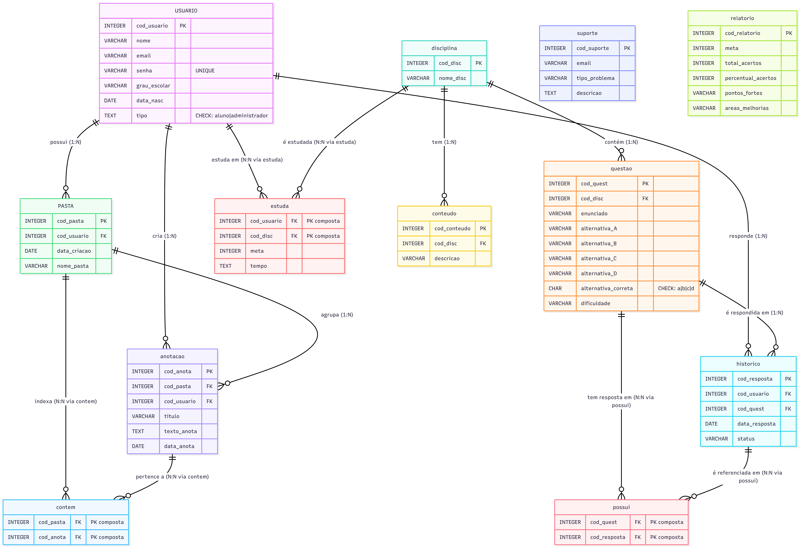

<div align="center">
      
# 🌟 LuminaSaber

### Plataforma web gamificada e gratuita de apoio ao aprendizado na educação básica

</div>

---

## 📖 Sobre o projeto

O **LuminaSaber** é uma plataforma web voltada para estudantes da educação básica, oferecendo **exercícios de múltipla escolha organizados por disciplina**, com acompanhamento de metas de estudo e relatórios de desempenho.

A proposta é incentivar a autonomia nos estudos por meio de uma experiência **gratuita, simples e organizada**, permitindo que o aluno escolha a disciplina, defina um tempo/meta de estudo, responda questões e acompanhe sua evolução — enquanto administradores conseguem cadastrar, editar e remover questões diretamente pela interface.

O projeto foi desenvolvido como atividade da disciplina de **Banco de Dados**, com foco na integração entre **front-end**, **back-end (Node.js/Express + TypeScript)** e **banco de dados relacional (SQLite)** através do **Prisma ORM**.

---
## 👩‍💻 Equipe

| Nome | Matrícula |
|------|-----------|
| Walesca Amaro Rodrigues | 20241780019 |
| Rayssa Priscila Silva Nascimento | 20241780013 |

---

## ✨ Funcionalidades

| Tela | Rota | Descrição | Acesso |
|------|------|-----------|--------|
| 🏠 **Home** | `/` | Apresentação da plataforma | Público |
| 📝 **Cadastro de usuário** | `/cadastro` | Formulário de cadastro (aluno ou administrador) | Público |
| 📚 **Seleção de disciplinas** | `/selecao` | Escolha da disciplina a ser estudada | Usuário |
| ⏱️ **Definição de tempo** | `/tempo` | Definição do tempo de estudo | Usuário |
| 🎯 **Meta de questões** | `/meta` | Definição da meta de questões a responder | Usuário |
| ✏️ **Exercícios** | `/exercicios` | Resolução das questões de múltipla escolha, com filtros e busca | Usuário |
| 📊 **Relatório** | `/relatorio` | Visualização de desempenho (acertos, pontos fortes e a melhorar) | Usuário |
| ⚙️ **Cadastro de exercícios** | `/cadastro-exercicios` | CRUD completo de questões (criar, listar, editar e excluir) | Administrador |

### Destaque: CRUD de Questões

A tela **Cadastro de Exercícios** (`/cadastro-exercicios`) é a principal demonstração de integração CRUD do projeto:

- **Create** — formulário cadastra novas questões via `POST /api/questoes`;
- **Read** — tabela lista todas as questões via `GET /api/questoes`;
- **Update** — botão "Editar" carrega os dados da questão e salva alterações via `PUT /api/questoes/:id`;
- **Delete** — botão "Excluir" remove a questão (com confirmação) via `DELETE /api/questoes/:id`.

Todas as operações são refletidas na interface em tempo real, sem necessidade de recarregar a página.

---

## 🚀 Tecnologias

### Back-end
- **Node.js** + **Express.js** — servidor HTTP e roteamento
- **TypeScript** (modo `strict`) — tipagem estática em todo o backend
- **Prisma ORM** — modelagem, migrations e acesso ao banco
- **@prisma/adapter-better-sqlite3** — adapter do Prisma para SQLite
- **Morgan** — logger de requisições HTTP
- **dotenv** — variáveis de ambiente
- **tsx** — execução de TypeScript sem build manual

### Front-end
- **HTML5** e **CSS3** (com seções responsivas via `@media queries`)
- **JavaScript** (Fetch API) — consumo da API REST diretamente do navegador, sem frameworks

### Banco de dados
- **SQLite** — arquivo local (`backend/src/database/db.sqlite`)
- **Prisma Migrate** — versionamento e criação automática das tabelas

### Testes de API
- **REST Client (VSCode)** — arquivo `backend/request.http` com casos de sucesso e erro

### Versionamento
- **Git / GitHub**

---

## 🏗️ Arquitetura (MVC)

O back-end segue o padrão **MVC (Model-View-Controller)**, adaptado para uma API REST:

```
Requisição HTTP
      │
      ▼
┌─────────────┐
│   Routes    │  → define os endpoints (ex: GET /api/questoes)
└─────┬───────┘
      ▼
┌─────────────┐
│ Controllers │  → valida dados de entrada, aplica regras de negócio,
└─────┬───────┘     trata erros e define o status HTTP da resposta
      ▼
┌─────────────┐
│   Models    │  → centraliza o acesso ao banco usando o Prisma Client
└─────┬───────┘
      ▼
┌─────────────┐
│   SQLite    │  → banco de dados relacional
└─────────────┘
```

- **Routes** (`backend/src/routes`): mapeiam URLs para funções dos controllers (`questaoRoutes.ts`, `usuarioRoutes.ts`, `pageRoutes.ts`).
- **Controllers** (`backend/src/controllers`): recebem `Request`/`Response`, validam parâmetros e o corpo da requisição, aplicam regras (ex.: campos obrigatórios, formato de e-mail, alternativa correta válida) e retornam respostas JSON com os códigos HTTP corretos (`200`, `201`, `400`, `404`, `409`).
- **Models** (`backend/src/models`): concentram **todas** as chamadas ao `prisma.questao.*` e `prisma.usuario.*` — nenhuma query SQL aparece nos controllers.
- **Erros**: uma classe `HttpError` (`backend/src/errors`) representa erros com status HTTP, capturados de forma centralizada por um middleware `errorHandler`.
- **Middlewares**: `contentTypeJson` garante que requisições `POST`/`PUT`/`PATCH` enviem `Content-Type: application/json`.

---

## 🗄️ Modelagem do banco de dados

A modelagem está em `backend/prisma/schema.prisma`, com **11 models** que representam as entidades do sistema, incluindo chaves primárias, chaves estrangeiras e relacionamentos 1:N e N:N.

<div align="center">
  
</div>

> Versão editável do diagrama (Mermaid): [`docs/erd.mmd`](docs/erd.mmd)

### Principais entidades

| Model | Descrição | Chave primária |
|-------|-----------|-----------------|
| `Usuario` | Alunos e administradores | `cod_usuario` |
| `Disciplina` | Matérias (Matemática, Português, etc.) | `cod_disc` |
| `Questao` | Questões de múltipla escolha (4 alternativas) | `cod_quest` |
| `Conteudo` | Tópicos/conteúdos de cada disciplina | `cod_conteudo` |
| `Pasta` | Pastas de anotações do usuário | `cod_pasta` |
| `Anotacao` | Anotações criadas pelo usuário | `cod_anota` |
| `Historico` | Registro de respostas (acertou/errou) | `cod_resposta` |
| `Relatorio` | Relatório de desempenho | `cod_relatorio` |
| `Suporte` | Solicitações de suporte/feedback | `cod_suporte` |
| `Estuda` | Associativa N:N entre `Usuario` e `Disciplina` (metas) | `cod_usuario` + `cod_disc` |
| `Contem` | Associativa N:N entre `Pasta` e `Anotacao` | `cod_pasta` + `cod_anota` |
| `Possui` | Associativa N:N entre `Questao` e `Historico` | `cod_quest` + `cod_resposta` |

### Exemplos de relacionamento

- **1:N** — Uma `Disciplina` possui várias `Questao` (`Questao.cod_disc → Disciplina.cod_disc`).
- **1:N** — Um `Usuario` pode criar várias `Pasta` e `Anotacao`.
- **N:N** — Um `Usuario` "estuda" várias `Disciplina` (e vice-versa), modelado pela tabela `Estuda`, que também guarda a meta e o tempo de estudo.
- **N:N** — Uma `Pasta` pode conter várias `Anotacao` (e uma anotação pode pertencer a mais de uma pasta), via `Contem`.

---

## 📁 Estrutura de pastas

```
LuminaSaber/
├── public/                          # Front-end (estático)
│   ├── home.html
│   ├── cadastro.html
│   ├── cadastro_exercicios.html     # CRUD de questões (admin)
│   ├── seleção_disciplinas.html
│   ├── defina_seu_tempo.html
│   ├── meta_questoes.html
│   ├── relatorio.html
│   └── tela_exercicios/
│       ├── exercicios.html
│       ├── css/style.css
│       └── js/ (main.js, filtros.js, carregarQuestoes.js)
│
├── backend/                          # Aplicação Node.js/Express
│   ├── server.ts                     # Ponto de entrada do servidor
│   ├── prisma.config.ts              # Configuração do Prisma (schema, migrations, seed)
│   ├── .env.example                  # Modelo de variáveis de ambiente
│   ├── package.json
│   ├── request.http                  # Testes de API (REST Client)
│   ├── prisma/
│   │   ├── schema.prisma             # Models, PKs, FKs e relacionamentos
│   │   └── migrations/               # Histórico de migrations do Prisma
│   └── src/
│       ├── routes/                   # Definição dos endpoints REST
│       ├── controllers/              # Validações, regras de negócio e respostas HTTP
│       ├── models/                   # Acesso ao banco via Prisma Client
│       ├── lib/prisma.ts             # Instância do Prisma Client (adapter SQLite)
│       ├── middlewares/              # contentTypeJson, errorHandler
│       ├── errors/HttpError.ts       # Classe de erro HTTP customizada
│       ├── database/seed.ts          # Carga inicial de dados
│       └── types/                    # Tipos TypeScript compartilhados
│
├── docs/
│   ├── erd.mmd                       # Diagrama ER (Mermaid)
│   └── erd.png                       # Diagrama ER renderizado
│
└── README.md
```

---

## ⚙️ Como executar o projeto

### Pré-requisitos

- [Node.js](https://nodejs.org/) (recomendado: versão 18 ou superior)
- [Git](https://git-scm.com/)
- Extensão **REST Client** no VSCode (opcional, para testar a API)

### Passo a passo

```bash
# 1. Clone o repositório
git clone https://github.com/walescaamaro/LuminaSaber.git
cd LuminaSaber

# 2. Acesse a pasta do backend (toda a aplicação fica aqui)
cd backend

# 3. Instale as dependências
npm install

# 4. Crie o arquivo de variáveis de ambiente
cp .env.example .env

# 5. Gere o Prisma Client
npm run prisma:generate

# 6. Crie/atualize as tabelas do banco de dados (Prisma Migrate)
npx prisma migrate dev

# 7. Popule o banco com dados iniciais
npm run seed

# 8. Inicie o servidor
npm start
```

Acesse no navegador: **http://localhost:3000**

> 💡 Durante o desenvolvimento, use `npm run dev` em vez de `npm start` — o servidor reinicia automaticamente a cada alteração.

> 🔍 Para visualizar e editar os dados do banco em uma interface gráfica, use `npx prisma studio`.

---

## 🔌 Rotas da API

**Base URL:** `http://localhost:3000`

### Questões

| Método | Rota | Descrição | Status |
|--------|------|-----------|--------|
| `GET` | `/api/questoes` | Lista todas as questões | `200` |
| `GET` | `/api/questoes/:id` | Busca uma questão pelo ID | `200` / `404` |
| `POST` | `/api/questoes` | Cria uma nova questão | `201` / `400` / `409` |
| `PUT` | `/api/questoes/:id` | Atualiza uma questão existente | `200` / `400` / `404` |
| `DELETE` | `/api/questoes/:id` | Remove uma questão | `200` / `404` |

**Exemplo — criar questão:**

```json
POST /api/questoes
Content-Type: application/json

{
  "cod_disc": 82211,
  "enunciado": "Qual é a capital do Brasil?",
  "alternativa_A": "Rio de Janeiro",
  "alternativa_B": "Brasília",
  "alternativa_C": "Salvador",
  "alternativa_D": "Belo Horizonte",
  "alternativa_correta": "b",
  "dificuldade": "fácil"
}
```

### Usuários

| Método | Rota | Descrição | Status |
|--------|------|-----------|--------|
| `POST` | `/api/usuarios` | Cadastra um novo usuário | `201` / `400` / `409` |
| `GET` | `/api/usuarios` | Lista todos os usuários | `200` |

**Exemplo — cadastrar usuário:**

```json
POST /api/usuarios
Content-Type: application/json

{
  "nome": "Maria da Silva",
  "email": "maria@email.com",
  "senha": "senha123",
  "grau_escolar": "9º ano",
  "data_nasc": "2010-05-14",
  "tipo": "aluno"
}
```

---

## 🧪 Testando a API

### Via REST Client (VSCode) — recomendado

Abra o arquivo [`backend/request.http`](backend/request.http) e clique em **"Send Request"** acima de cada bloco. O arquivo já cobre:

- consultas válidas, por ID inexistente e com ID inválido (`GET`);
- criação válida, com campos obrigatórios ausentes e com dados inválidos (`POST`);
- atualização válida, de registro inexistente e sem corpo (`PUT`);
- remoção válida, de registro inexistente e com ID inválido (`DELETE`).

### Via cURL

```bash
# Listar todas as questões
curl http://localhost:3000/api/questoes

# Buscar questão por ID
curl http://localhost:3000/api/questoes/11154
```

---

## 📝 Dados iniciais (seed)

O comando `npm run seed` popula o banco com dados de exemplo para testes:

| Tabela | Quantidade | Exemplos |
|--------|-----------|----------|
| Usuários | 10 | 2 administradores e 8 alunos |
| Disciplinas | 7 | Matemática, Português, Ciências, Inglês, História, Geografia, Artes |
| Questões | 35 | 5 a 6 questões por disciplina, níveis fácil/médio/difícil |
| Conteúdos | 12 | Tópicos como "Operações Básicas", "Interpretação de texto", etc. |
| Pastas | 5 | Pastas de anotações por tema |
| Anotações | 5 | Resumos de estudo |
| Histórico | 5 | Respostas registradas (acertou/errou) |

---

## 🔄 Roadmap

Funcionalidades previstas para próximas versões:

- [ ] Autenticação de usuários (login com perfis de aluno e administrador)
- [ ] CRUD completo de usuários pelo front-end (editar/remover)
- [ ] Módulo de anotações (criação de pastas, edição, exclusão e exportação em PDF)
- [ ] Módulo de histórico com opção de refazer questões anteriores
- [ ] Painel administrativo para gerenciamento de usuários

---

## 📄 Licença

Este projeto foi desenvolvido para fins educacionais, como atividade da disciplina de **Banco de Dados** do **Instituto Federal de Educação, Ciência e Tecnologia da Paraíba (IFPB)**.
